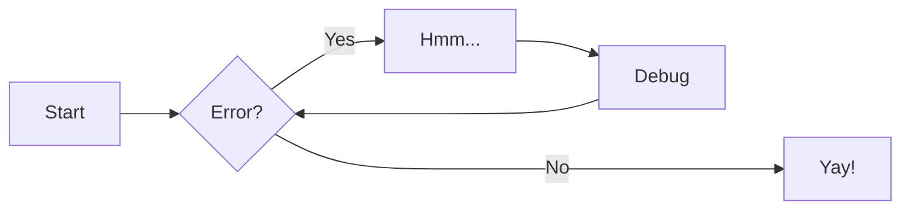
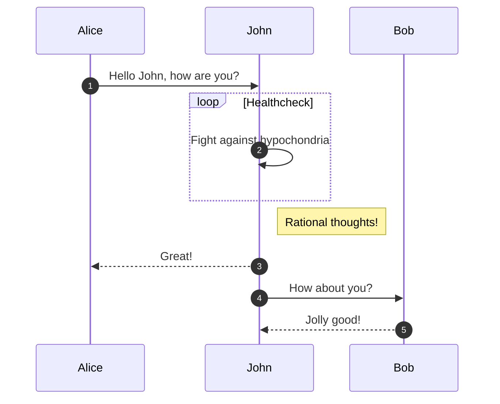

# Page 2

## Another heading

Some more example text

## Tables

### Simple

| Method   | Description                          |
| -------- | ------------------------------------ |
| `GET`    | :material-check: Fetch resource      |
| `PUT`    | :material-check-all: Update resource |
| `DELETE` | :material-close: Delete resource     |

## Diagrams

### Flowcharts

### Sequence Diagrams

## Lists

### Task List

- [x] Lorem ipsum dolor sit amet, consectetur adipiscing elit
- [ ] Vestibulum convallis sit amet nisi a tincidunt
- [x] In hac habitasse platea dictumst
- [ ] Aenean pretium efficitur erat, donec pharetra, ligula non scelerisque

## Notes

### Simple

!!! note "Phasellus posuere in sem ut cursus"

    Lorem ipsum dolor sit amet, consectetur adipiscing elit. Nulla et euismod
    nulla. Curabitur feugiat, tortor non consequat finibus, justo purus auctor
    massa, nec semper lorem quam in massa.

### Info

!!! info

    Lorem ipsum dolor sit amet, consectetur adipiscing elit. Nulla et euismod
    nulla. Curabitur feugiat, tortor non consequat finibus, justo purus auctor
    massa, nec semper lorem quam in massa.

!!! tip

    Lorem ipsum dolor sit amet, consectetur adipiscing elit. Nulla et euismod
    nulla. Curabitur feugiat, tortor non consequat finibus, justo purus auctor
    massa, nec semper lorem quam in massa.

### Collapsible

??? note

    Lorem ipsum dolor sit amet, consectetur adipiscing elit. Nulla et euismod
    nulla. Curabitur feugiat, tortor non consequat finibus, justo purus auctor
    massa, nec semper lorem quam in massa.
